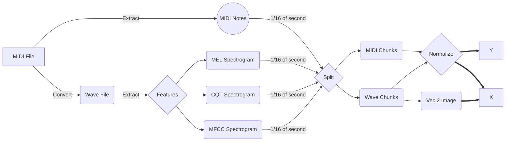

```mermaid
graph LR
   MIDI[MIDI File] -->|Extract| NOTE((MIDI Notes))
   NOTE --> |1/16 of second|SPLIT{Split}
   SPLIT--> CHUNK(MIDI Chunks)
   MIDI --> |Convert| WAV(Wave File)
   WAV --> |Extract| FEAT{Features}
   SPLIT -->WAV_CHUNK(Wave Chunks)
   FEAT --> MEL(MEL Spectrogram)
   FEAT --> CQT(CQT Spectrogram)
   FEAT --> MFCC(MFCC Spectrogram)
   MEL --> |1/16 of second| SPLIT
   CQT --> |1/16 of second| SPLIT
   MFCC -->|1/16 of second| SPLIT
   CHUNK-->NORM{Normalize}
   WAV_CHUNK-->NORM{Normalize}
   WAV_CHUNK-->V2I(Vec 2 Image)
   NORM==>Y
   NORM==>X
   V2I==>X
   
```


```

```

