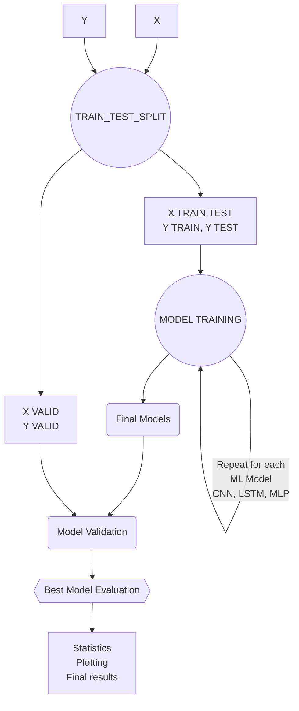

```mermaid
graph TB
	X[X]
	Y[Y]
	XY_T[X TRAIN,TEST <BR> Y TRAIN, Y TEST ]
	XY_V[X VALID <BR> Y VALID]
	TTV((TRAIN_TEST_SPLIT))
	MT((MODEL TRAINING))
	FM(Final Models)
	MV(Model Validation)
	BME{{Best Model Evaluation}}
	ST[Statistics<br> Plotting <br>Final results]
	
	
	X-->TTV
	Y-->TTV
	TTV-->XY_T
    TTV-->XY_V
    XY_T-->MT
    MT-->|Repeat for each <br> ML Model <BR>  CNN, LSTM, MLP|MT
    MT-->FM
    FM-->MV
    XY_V-->MV
    MV-->BME
    BME-->ST
```


```

```

